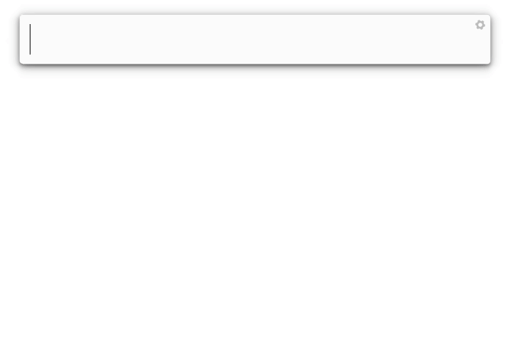
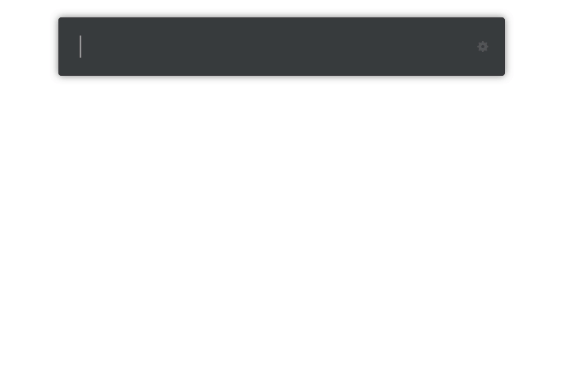

#  Ulauncher/Albert File Search Extension

File and Directory search using Cache, **`gitignore`** style and Unix style matching (wildcards).

## Albert Demo



## Ulauncher Demo 



## Features
- Specify directories to search
    - Specify max depth if you want
- Specify directories and files to skip `gitignore` style
    - Works almost like `gitignore`
    - Nested `gitignores` override parrent if possible (see `tests/template_structure` and the `.albertignore2` files in there).
        - e.g Ignore all hidden files in parent directory, unignore a hidden directory in a child ignore file.
- Search files really fast (unless scan index your whole system)
    - Search is scored based on
        - Unix style matching (preferred over the next one)
        - Word matching
        - File/Directory depth
- Tweak almost every setting
    - Icon Themes
    - Scan interval
    - Search threshold
    - Search character threshold
    - Max results returned

## Contents

- [Install for Ulauncher](#install-for-ulauncher)
- [Install for Albert](#install-for-albert)
- [How to setup](#how-to-setup)
- [Examples](#examples)
- [Tests](#tests)

## Install for Ulauncher

Thus extension depends on [pathspec](https://github.com/cpburnz/python-path-specification).

Install it with:
```bash
pip install pathspec
```

Open `Ulauncher` go to `Extensions` > `Add extension` and paste https://github.com/tchar/ulauncher-albert-files

## Install for Albert

Similarly to `Ulauncher` the same dependencies are are required.

To install the extension for Albert run
```bash
pip install pathspec
mkdir -p ~/.local/share/albert/org.albert.extension.python/modules/
git clone https://github.com/tchar/ulauncher-albert-files ~/.local/share/albert/org.albert.extension.python/modules/
```

Open albert, enable `Python` extensions and then enable the `Files` extension.

You can double click it to open module's location and edit `__init__.py` to edit your trigger by editing the `__trigger__` variable.

The other settings can be editted in the settings.ini

## How to Setup

### Albert

If you ar using Albert open the extension location normally at `~/.local/share/albert/org.albert.extension.python/modules/ulauncher-albert-files/__init__.py` and edit the trigger named `__triggers__` to change the keyword

The file `~/.local/share/albert/org.albert.extension.python/modules/ulauncher-albert-files/settings.ini` contains the settings 

The extension can work in albert without keywords if you comment out the `__triggers__` option, however if another extension has the keyword you type, `Files won't trigger` (see [relevant issue](https://github.com/albertlauncher/albert/issues/978))

### Ulauncher

If you are using Ulauncher use the extension preferences.

### Options

- Main Options
    - `albert`: Under `[DEFAULT]`
    - Scan Every Minutes: Interval to scan directories specified (default 2 minutes)
        - `ulauncher`: `Scan interval in minutes`
        - `albert`: `SCAN_EVERY_MINUTES`
    - Ignore filename: The filename to use as ignore
        - `ulauncher`: `Name of ignore file`
        - `albert`: `IGNORE_FILENAME` (default .albertignore2)
    - Search after Characters: Number of characters to skip before run searching (default 2, if set to 0 searches from first character, excluding keyword)
        - `ulauncher`: `Characters to start searching after`
        - `albert`: `SEARCH_AFTER_CHARACTERS`
    - Search Max Results: Maximum number of results to return (default 5)
        - `ulauncher`: `Maximum Search Results`
        - `albert`: `SEARCH_MAX_RESULTS`
    - Search theshold: Threshold value to keep or drop result (default 0.5, between 0.0 and 1.0)
        - `ulauncher`: `Threshold to limit searches`
        - `albert`: `SEARCH_THRESHOLD`
    - Icon Theme: The icon theme to use. Can be a path of a folder which contains images of icons named with the extension`[.svg|.png|or any other image]`. Built in icon themes are: `square-o`, `classic`, `high-contrast`, `vivid`. Default `square-o`
        - `ulauncher`: `Name or Path of icon theme`
        - `albert`: `ICON_THEME`
    - Use built in folder theme: If set to `No/False` it will try to fetch folder icons based on your gtk icon theme. If set to `Yes/True` it will use the built-in folder icons (default `No/False`)
        - `ulauncher`: `Use built in folder theme`
        - `albert`: `USE_BUILT_IN_FOLDER_THEME`
- Path options:
    - `ulauncher`: `Directories to scan, as well as depth`: Set a directory to scan in each line of the text area as follows:
        - Specify directory e.g (`~/`)
        - Optionally specify max depth (5 for example) to scan as (`~/=5`)
    - `albert`: You can view the `settings_example.ini` for another example. Specify as many `[DIRECTORY]` sections you want each starting with prefix `DIRECTORY` and some number or other character
    examples: `[DIRECTORY1]`, `[DIRECTORY2]`, `[DIRECTORY_A]`, `[DIRECTORY_B]` etc. Each `DIRECTORY` section should have:
        - `PATH=/some/path`: An path in your system. You can use tilde (`~`) for your `home`
        - `DEPTH=`: Optionally a depth to scan the aforementioned directory up to. If not set or set to `0` it will scan


## Examples

Use your keyword (default `?`) and type something to search.

You can use normal matching: `? Downloads` or `? A_file`

You can use wildcard matching: `? *.png` or `? some_file*.pdf`
The results are usually fast if you don't scan your whole filesystem

## Tests

To run tests you need pytest
```
pip install pytest
pytest
```

The test runs against a template structured located in `tests/template_structure`. You can follow the `.albertignore2` file along the `template_structure` to check what is ignored and what not.
